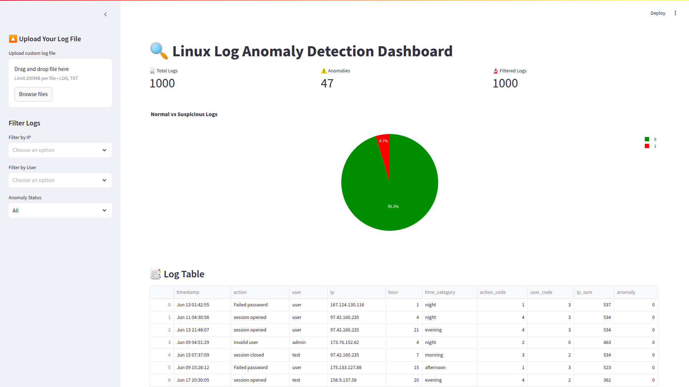
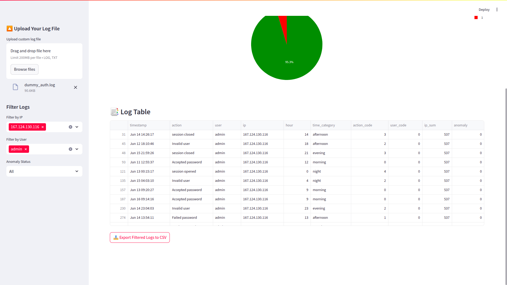

# 🛡️ AI Log Analyzer for Linux (Offline Anomaly Detection)


A full-featured AI-powered Linux system log anomaly detection app. Built for offline usage with privacy-first design — detects unusual logins, brute force attempts, and SSH anomalies from system logs.

🔗 **Download `.deb` Installer**  
👉 [ai-log-analyzer.deb][https://your-download-link](https://drive.google.com/file/d/1Tc8z5ePiRJ0LH4lHEqyoAbU8_cwsx2y2/view?usp=drive_link]

---

## 🚀 Features

- ✅ AI-based anomaly detection (unsupervised model)
- 📊 Interactive dashboard (search, filter, sort, export)
- 🧠 Train model on your own uploaded logs
- 🖼️ Desktop-style native GUI (Streamlit)
- 📦 Install as `.deb` like a real Linux app
- 🔐 Runs 100% offline – no data leaves your machine

---

## 📸 Screenshots

| Dashboard | Upload & Train |
|-----------|----------------|
|  |  |

---

## 🧑‍💻 Getting Started

### 📥 1. Install App (`.deb`)
```bash
sudo dpkg -i ai-log-analyzer.deb
